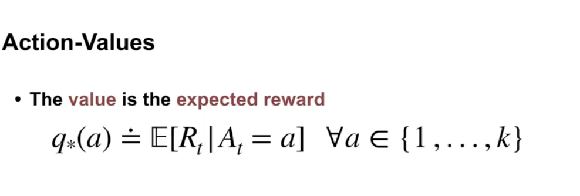
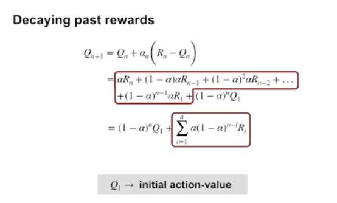
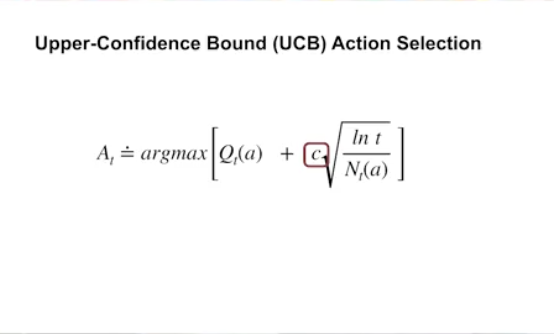

Reinforcement Learning (RL) 強化學習是一種通用的自動化學習方法.
主要是想要了解目前LLM Training中Reasoning得背景知識跟想像是否有可能跟晶片驗證結合再一起

明天會學習k-armed Bandait Problem

考慮在不確定情況下做決定

Agent:決定者 
Action: 有Ｋ種可執行動作
Reward: 執行動作的結果 
q*a 定義為選擇Action得Reward對所有Action
目標為最大化Reward (argmax)

策略: 
1. Sample Average Methods (採取T time 的Reward總和/Ｔ time )
   -> 描述過往採用的平均結果
2. Greedy-> 採取當前local最優解(ARGMAX)->稱為exploitation(利用過往知識採取最優解)
3. 反之為Expedition(探索非當前最優解結果)

為了提高更好的Performance 能夠對於Sample Average methods 進行化簡
Qn+1=Qn+(Rn-Qn)/n
New Estimate = Old Estimate +(StepSize)(Target-Object)

Decaying Past Rewards 

如何權衡
探索(Exploration)-> 探索有益長期效益的資訊->降低不確定性
利用(Exploitation)->得到短期效益?

方法1. 隨機探索
Eplison Greedy(Eplison 選擇的機率)

方法2. Optimistic Initalization 
在一開始使用較高的初始值鼓勵在一開始採用探索
後期不會探索(不適合非穩態問題)
如何設置最大獎勵也是一個問題->現實問題不知道最大獎勵為何

方法3: upper-confidence Bound (UCB)

利用估計值中的不確定性,估計值會在信心區間中移動(在上界跟下界)的數值
永遠取最高上界的數值

但是如何決定上界? 利用選擇的次數跟Q*來估計？

現實中RL ->Shift the priority
Real World 重要的Factor
Generalization 
Environment COntrol 
Statistcal Efficieny
Feature 
Evaluation
Every Policy
Simulator關注的Factor
Temproal Credit
Control Env
Computation Environment
State
LEarning
Last Policy

Contextual Bandit Tutorial 
Ref : Cousera RL Specialization系列